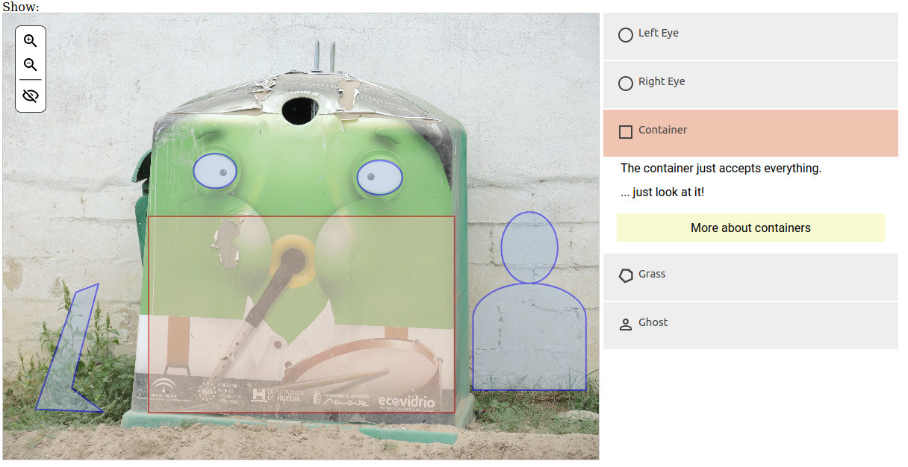
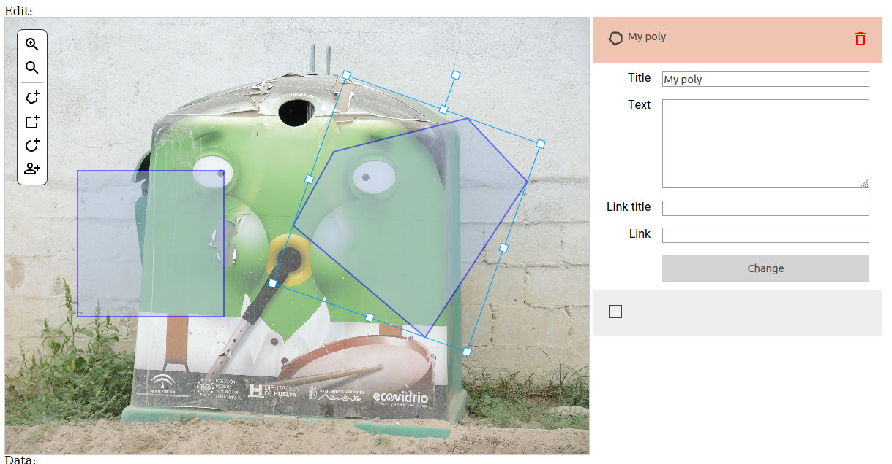

# picture-annotation

Web based picture annotator - can be used define areas within a picture that contain a title, a description and a link.

Screenshot:



It's just Javascript that can be included on any website either as traditional Javascript or as web component.

The script can also be used to create annotations using an edit mode, as seen here:

 

Developed for and sponsored by the [Memorial Archives](https://memorial-archives.international/).


## Installation

You need the npm package manager installed.

Clone and compile:

```shell script
git clone https://github.com/mkalus/picture-annotation.git
cd picture-annotation

npm install

# regular build
npm run build

# OR
# web component
npm run build:wc
```

To live-test picture-annotation, you can run a development server:

```shell script
npm run serve
```

Point your browser to http://localhost:8080/ to see the demo site.


## Using picture-annotation

### Classic Javascript

Once you have compiled picture annotation (using `npm run build`, see above), you can include in your scripts. The code
built will reside in the `dist` folder.

You will need three files to be included into your HTML page:

* `picture-annotation-chunk-vendors.min.js`: Third party packages (such as Vue, Konva and Material Design Icons)
* `picture-annotation.min.js`: The app code
* `css/app.css`: Minified CSS

Be sure to include the vendors file before the app code.

After this, you can add one or more picture annotators to your site. Look at the following minimal code fragment:

```html
<div id="my-pic-annotation" class="picture-annotation" data-image-src="my-pic.jpg"
     data-width="1200" data-height="600" data-edit-mode="1" data-callback="callBack"></div>
```

This will create an annotator of 1200x600px in edit mode, using `my-pic.jpg`. Whenever the annotation has been changed,
a callback function will be called. It will receive a JSON string as parameter. To exemply this:

```html
<script type="application/javascript">
    function callBack(data) {
        console.log(data);
    }
</script>
```

To create a viewer, you can add the following code:

```html
<div id="my-pic-annotation-view" class="picture-annotation" data-image-src="my-pic.jpg"
     data-width="1200" data-height="600" >
     <div class="picture-annotation-data" style="display:none;">JSONDATA</div>
</div>
```

... where JSONDATA would be the serialized JSON string.

Complete list of parameters:

* `id`: Unique id of the element. Should be added in any case.
* `class`: has to contain `picture-annotation` in order to work.
* `data-image-src`: path to image to show
* `data-width`: Width of element - if not set, will try to use the whole parent container.
* `data-height`: Height of element - if not set, will try to use the whole parent container.
* `data-language`: Controls language (for now, can be `en` or `de`). Translators are welcome.
* `data-edit-mode`: If set to `1`, this will activate the edit mode.
* `data-local-storage-key`: Browser's local storage key to save JSON data in or to load from.
* `data-callback`: Callback function to call after each change in edit mode.
* `data-initial-data-id`: Id of element containing serialized JSON data.

Alternatively, as shown above, the picture-annotation div can include a child of class `picture-annotation-data`. If this
is the case, the data will automatically be loaded from this place.

### Web Component

picture-annotation can also be included as a web component. Most modern browsers support this format (not IE or Edge).

After compiling, one only has to include view and a single app file:

* `https://cdn.jsdelivr.net/npm/vue`: Production vue script
* `lw-picture-annotation.min.js`: App script

Deployment is very similar to the classical way. For example:

```html
<lw-picture-annotation container-id="my-pic-annotation" image-src="my-pic.jpg"
    width="1200" height="600" edit-mode="1" data-callback="callBack"></lw-picture-annotation>
```

View example:

```html
<lw-picture-annotation container-id="my-pic-annotation-view" image-src="my-pic.jpg"
    width="1200" height="600" initial-data-id="my-pic-annotation-view-data"></lw-picture-annotation>
<div id="my-pic-annotation-view-data" style="display:none;">JSONDATA</div>
```

As you can see, JSON data is not contained within the element, but outside, and referenced by a unique id.

Complete list of parameters:

* `container-id`: Unique id of the element. Should be added in any case.
* `image-src`: path to image to show
* `width`: Width of element - if not set, will try to use the whole parent container.
* `height`: Height of element - if not set, will try to use the whole parent container.
* `language`: Controls language (for now, can be `en` or `de`). Translators are welcome.
* `edit-mode`: If set to `1`, this will activate the edit mode.
* `local-storage-key`: Browser's local storage key to save JSON data in or to load from.
* `data-callback`: Callback function to call after each change in edit mode.
* `initial-data-id`: Id of element containing serialized JSON data.
* `initial-data`: Serialized JSON data (might be a bit awkward to put this into an attribute, `initial-data-id` should
  be preferred).
